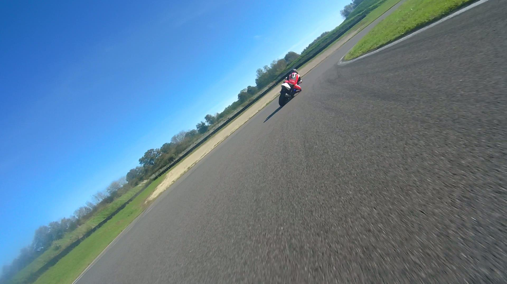
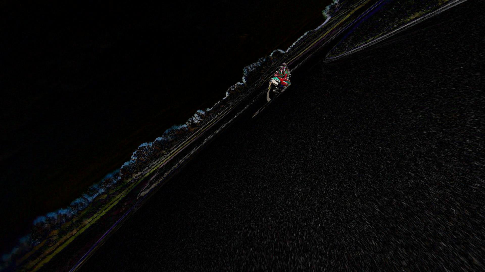
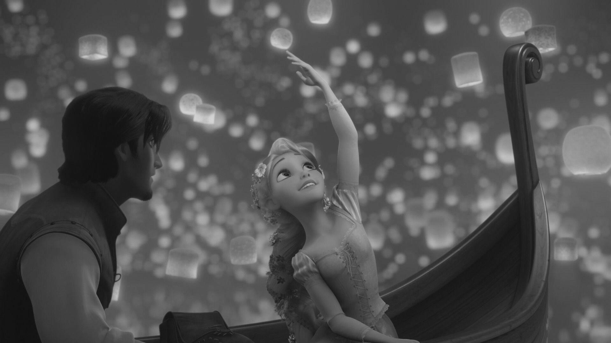
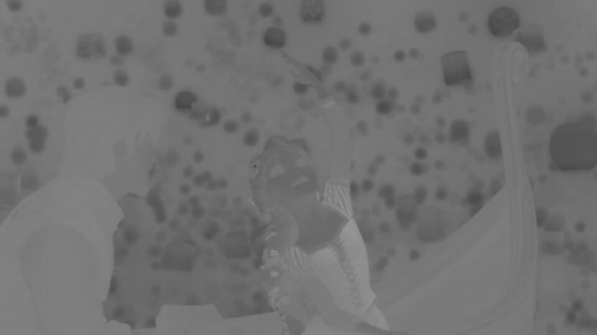
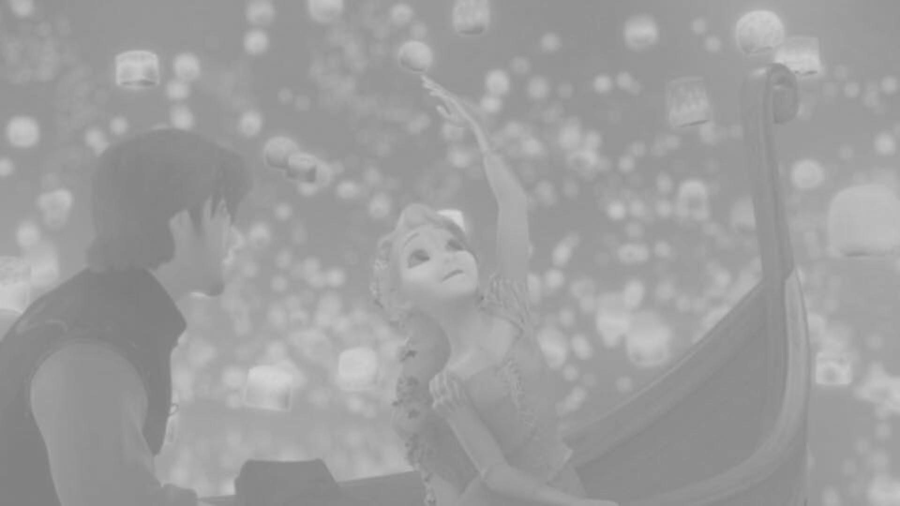
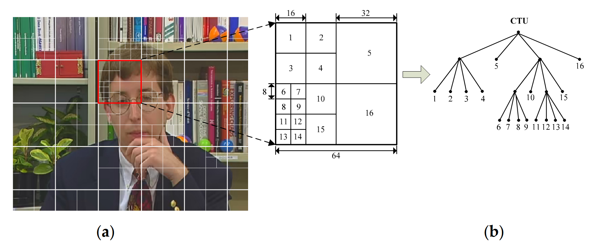
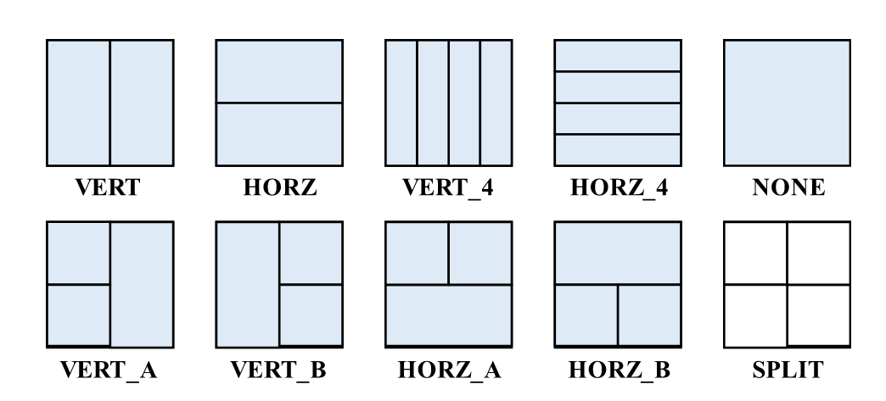
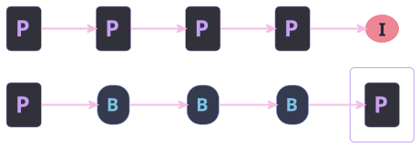
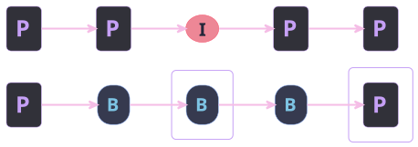
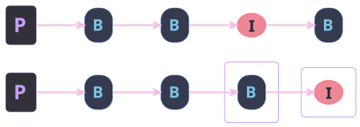

## Goal

- Understanding of how video compression works
  - Human visual system limitations
  - H264 Advanced Video Coding (AVC)
  - H265 High Efficiency Video Coding (HEVC)
  - H266 Versatile Video Coding (VVC)
  - AV1 (AOMedia Video 1)
- Artifacts generated and digital forensic

# Video compression basis

## Psychovisual redundancies

Based on Human Visual System (HVS) imperfections

::: incremental
- 100 million rods (brightness)
- 6.5 million cones (color)
- smooth fine patterns
- not sensitive to fast changes
:::

::: {.notes}
- optic of eye + neural processing => smooth
- L-cones (≈ 65%) long wavelengths (red)
- M-cones (≈ 33%) medium (green).
- S-cones (≈ 2%) short (blue)
:::

## Statistical redundancies

::: {layout-ncol="2"}

Difference between consecutives frames 60fps

:::

::: {.notes}
- Spatial
  - Pixel correlated to neighborhood
- Spectral
  - Pixel color correlated to neighborhood
- Temporal
  - Small difference between consecutives frames
:::

# Video Compression

## General Video Compression scheme {.small-bg background-image="img/diagram.svg" background-size="95%"}

## YCbCr

::: {layout-ncol="3"}

:::

## Partitioning

::: {.notes}
H264: MacroBlocks 16x16

H265: CTU: 64x64 (quad tree)

H266: Multi-Type-Tree 128x128 (quad, tertiary, binary, no split)

AV1: SuperBlocks 128x128
:::

## Partitioning: example AV1

## Prediction (1/2)

#### Intra-prediction

- Predict block on single frame without informations from other frames
- Accept different modes

::: {.notes}
Intra prediction

- h264: 9 modes
- h265: 35 modes
- h266: 67 modes
- av1: 56 modes
:::

## Prediction (2/2)

#### Inter-prediction

- Predict block according to previous and past frames
- Different kind of predicted frames
  - I-frames: only intra-predicted
  - P-frames: take care aboud **previous** frames only
  - B-frames: take care about **previous** and **next** frames

::: {layout=[1] style="text-align: center"}

:::

::: {.notes}
Inter prediction

- take more images as references (av1: 7)
- Motion vector computation
- geometric partitioning
- (merge mode)
- compound prediction: complex frame masking

:::

## Transform

- Discrete Cosine Transform (DCT)
- Discrete Sine Transform (DST)
- Asymmetric Discrete Sine Transform (ADST) / FlipADST
- Identity (IDTX)

::: {.notes}

Transform can be made in each direction

- Combine transformations ! (AV1)
- ADST: directional gradients
- IDTX for brutal transitions (Ex: text on white) / Avoid artifacts (blurring edge, ...)
- DST: more efficient for some luma components due to block structure...

:::

## Quantize

- Static quantization (H264, H265)
  - Good explanation on the website [abhik.xyz](https://www.abhik.xyz/articles/h264-transform-quantization)
- Dynamic quantization (H266, AV1)

::: {.notes}

- Dynamic quantization
Ex: [0.2, 0.3, 0.6] -> [0, 0, 0] instead of [0, 0, 1]

  - face high quality kept
  - sharp edge: no quantization avoiding resonnance artifacts
  - background low quality

:::

## Entropy encoding

- Context-Adaptative Variable-Length Coding (CAVLC)
- Context-Adaptative Binary Arithmetic Coding (CABAC)
- (Asymmetric Numeral Systems) ANS

::: {.notes}
- ANS encodes directly symbols
- Parallelizable
- Similar performances to CABAC
:::

## Uncompress

Usage of Deblocking Filters

::: {.notes}
- ringing artifacts: distortions around sharp borders by removing high frequencies
- blocking artifacts: caused by DCT transform and quantization -> discontinuities at block boundaries
:::

# Forensic

::: {.notes}

Video -> Uncompress -> Modifications -> Compress -> Modified Video

:::

## Partitioning

- Grid misalignment (H264)
- DeepFakes Videos introduce some noise at unexpected locations (flat blue sky)
- Frame partitioning too complex and well managed to be performed by expected device (H266 / AV1)
- Specific shapes (AV1)

## Prediction (1/2)

- Motion vector analysis (DeepFakes Videos)
- Group Of Pictures (GOP) analysis (Frame deletion / insertion / duplication / shuffling / ...)

## Prediction (2/2)

::: {layout="[[1,1], [1]]" style="text-align: center"}

:::

## Quantization / Entropy encoding

- Block artifacts
- Flickering
- Ringing artifacts
- Metadata analysis
- Direct bitstream analysis

::: {.notes}

- DCT applied on each block -> artifact on block borders
- (Video )

:::

## Conclusion

- Knowledge of how video compression works allows better understanding on how digital forensic perform analysis

- Forensic digital analysis techniques are based primarily on GOP structure analysis, but also on motion vector analysis, etc...

- **BUT** the H266 and AV1 formats are still new and require the development of new digital forensic analysis methods

- *What's about the AV2 format, which is announced for the end of 2025?*

# Questions
