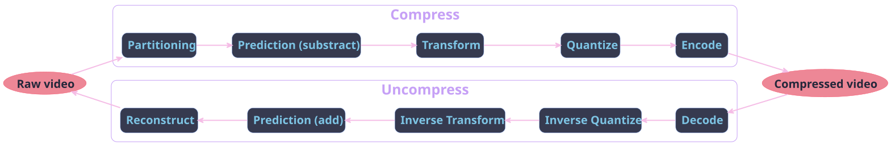

## Goal

- Understanding of how video compression works
  - Human visual system limitations
  - H264 Advanced Video Coding (AVC)
  - H265 High Efficiency Video Coding (HEVC)
  - H266 Versatile Video Coding (VVC)
  - AV1 (AOMedia Video 1)
- Artifacts generated and digital forensic

# Video compression basis

## Psychovisual redundancies

Based on Human Visual System (HVS) imperfections

::: incremental
- 100 million rods (brightness)
- 6.5 million cones (color)
- smooth fine patterns
- not sensitive to fast changes
:::

::: {.notes}
- optic of eye + neural processing => smooth
- L-cones (≈ 65%) long wavelengths (red)
- M-cones (≈ 33%) medium (green).
- S-cones (≈ 2%) short (blue)
:::

## Statistical redundancies

::: {layout-ncol="2"}

Difference between consecutives frames 60fps

:::

::: {.notes}
- Spatial
  - Pixel correlated to neighborhood
- Spectral
  - Pixel color correlated to neighborhood
- Temporal
  - Small difference between consecutives frames
:::

# Video Compression

## General Video Compression scheme

{width=140%}

## YCbCr

::: {layout-ncol="3"}

:::

## Partitioning

::: {.notes}
H264: MacroBlocks 16x16

H265: CTU: 64x64 (quad tree)

H266: Multi-Type-Tree 128x128 (quad, tertiary, binary, no split)

AV1: SuperBlocks 128x128
:::

## Partitioning: example AV1

## Prediction

#### Inter-prediction

- Predict block according to previous and past frames
- Different kind of predicted frames
  - I-frames: only intra-predicted
  - P-frames: take care aboud **previous** frames only
  - B-frames: take care about **previous** and **next** frames

#### Intra-prediction

- Predict block on single frame without informations from other frames
- Accept different modes

::: {.notes}
Intra prediction

- h264: 9 modes
- h265: 35 modes
- h266: 67 modes
- av1: 56 modes

Inter prediction

- take more images as references (av1: 7)
- Motion vector computation
- geometric partitioning
- (merge mode)
- compound prediction: complex frame masking

:::

## Transform

- Discrete Cosine Transform (DCT)
- Discrete Sine Transform (DST)
- Asymmetric Discrete Sine Transform (ADST) / FlipADST
- Identity (IDTX)

::: {.notes}

Transform can be made in each direction

- Combine transformations !

:::

