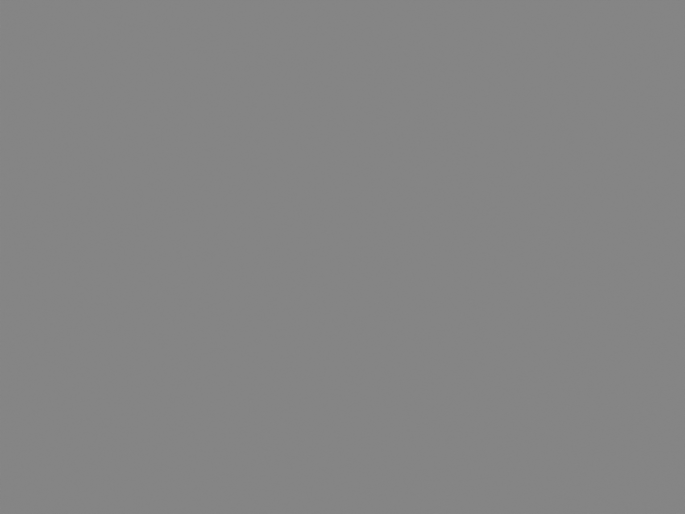
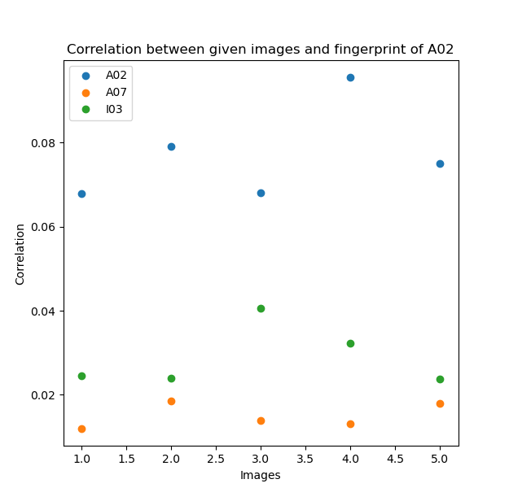
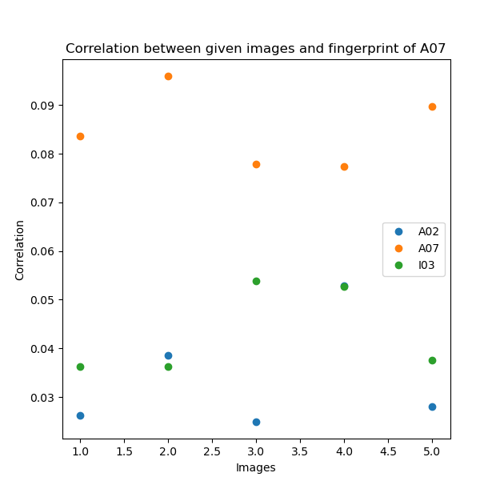
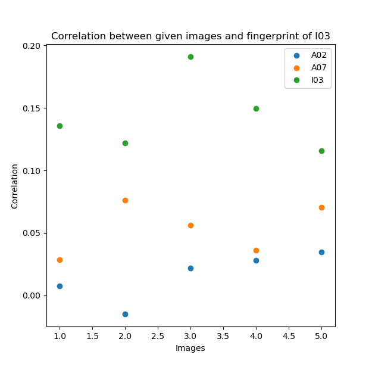

\newpage

# Introduction

In our digital world with improvements of Artificial Intelligence, it's more and more complex to determine the source of informations.

Digital fornesic answers to this requirements and give a way to determine the provenance of a photo if this photo was taken by a camera.

In this work, we will implement and analyse a digital forensic method that determine the provenance of an image.

# Methodology {#sec-met}

## Camera basis

First, we will take a look at the camera operation.

Human visual system captures the photons from the light which ricochet against objects.
Then, the brain convert theses photons informations into an image.

A camera is based on the human visual system: the camera will capture photons from light and convert them into pixels.

## Noise {#sec-noise}

During this processus, photons go through the lens of the camera and are catched by the color sensor.
There are different kind of color sensors and lens for cameras, depending on constructor.

However, theses lens and color sensors contains imperfections or don't have same sensibility...
This appears as noise on the taken photos

We have two kind of noise:

- The fixed pattern noise (FPN). It's an additive noise that is the pixel wise difference in dark conditions, produced by imperfections of sensors.
- The photo response non uniformity noise (PRNU). It's a multiplicative noise caused also by sensors imperfections.
  In fact, the sensor is composed by millions of photons containers, which have not exactly the same capabilities due to imperfections that comes with the construction of the sensor.
  For instance, a container could accept more photons than another.

Furthermore, as constructors don't use same technologies, the noises obtained on camera will depend on technologies used, so on the constructor, each model having it's own characteristics.

## Image detection

The two types of noise mentionned in section [@-sec-noise] don't varies when taking photos and are specific to each camera.
We call the noise specific to a camera the _fingerprint_ of the camera, each being unique.
That's why it's possible to extract this noise and, based on this noise, to determine which camera has taken the given photo.

In most of case, we can't use FPN noise because constructor removes this noise directly in the device to have the best photo quality possible.

That's why, we will try a method based on the PRNU noise to determine the camera that have taken the picture.

### Requirements

The accuracy of the image detection is based on the quality of the acquisition of the fingerprint of the camera.

To extract the fingerprint of a camera, we need some pictures from this camera that respect the following requirements:

- At least 15 pictures from this camera must be provided, allowing to compute the PRNU of each image and to calculate the mean of the obtained PRNUs.
  This is a way to obtain a _general_ fingerprint of the camera whereas with only 1 image, the fingerprint could be specific.
- Pictures must have a high quality compression, and if it's possible the image must not be compressed to avoid a loss of PRNU informations in compression.
- Pictures must be flat-field. It allows to detect variations in pixels that are due to defaults and not to complexity of environment.
- Pictures must be brightly but not saturated. The brightness will boost the sensor signal and make imperfections easier to detect.
- Pictures must have same size for simplicity when computing the mean of the PRNU obtained

### Fingerprint computation

To compute the fingerprint of the camera, we calculate the PRNU of each picture provided from the camera and then we compute the PRNU fingerprint by the sum of all the PRNUs obtained.

We can describe the computation of the PRNU fingerprint by the following steps:

1. Compute the residual $W_I$ of an image $I$ according to the denoising filter $F$, given by the formula [-@eq-residual].

  $$W_I = I - F(I)$$ {#eq-residual}

2. Compute the $\text{PRNU}_I$ of the image $I$ by the following formula [-@eq-prnu].

   $$\text{PRNU}_I = \frac{W_I I}{I^2}$$ {#eq-prnu}

3. Compute the final PRNU fingerprint by adding the contribution of the $\text{PRNU}_I$ for each image $I$ given to obtain the fingerprint PRNU, like shown in the following formula [-@eq-fingerprint].

   $$\text{PRNU} = \frac{1}{N}\sum_I^N \text{PRNU}_I$$ {#eq-fingerprint}

4. (Optional) Normalize the fingerprint to have something in a good range and store it on the disk in a lossless compression way (no data is lost in image compression).

### Source camera identification

Now we assume the fact that we have the fingerprint of the camera.

We want to detect that a picture is taken or not by this camera.

To do that, we begin by computing the $\text{PRNU}_I$ of the image $I$, according to the formula [-@eq-prnu].

Then we compute the correlation between the fingerprint and the $\text{PRNU}_I$.

Finally, we can compute the correlation for some images that are not taken by the camera and then compare values obtained to determine if the photo was taken by the given camera.

# Implementation {#sec-impl}

My python program follow the given documentation:

```{text}
usage: tp2.py [-h] [-d DIRECTORIES [DIRECTORIES ...]] [-f FINGERPRINT] [-l LABELS] [-m MODEL] [-s SAVING_PATH]

Find PRNU of camera

options:
  -h, --help            show this help message and exit
  -d, --directories DIRECTORIES [DIRECTORIES ...]
                        directories where are stored images took by specific camera
  -f, --fingerprint FINGERPRINT
                        Fingerprint of the camera
  -l, --labels LABELS   Labels for graph output. You must provide a label by directory given. Default is the name of directories.
  -m, --model MODEL     Model of the camera. Default is 'model'
  -s, --saving_path SAVING_PATH
                        Path where fingerprint will be stored. Default is '.'
```

If we don't give any fingerprint, the program will compute the fingerprint of the given set of photos and store the resulting fingerprint in the path given by argument `-s`.

Else, the program will compute the resulting correlation between the given fingerprint and the images contained in the given directories.
Then, a graph is computed and printed to the user with all resulting correlations, with label of each set of points given by the name of the directories or by a user defined label.

For instance, according to the following structure:

```{text}
.
├── Dataset_Lab2
│   ├── A02_test
│   ├── A02_train
│   ├── A07_test
│   ├── A07_train
│   ├── I03_test
│   └── I03_train
└── digital_forensic
    └── code
        └── tp2.py
```


The computation of the fingerprint for model `A02` is given by the following command:

```{bash}
cd digital_forensic/code
python tp2.py \
  -d ../../Dataset_Lab2/A02_train \
  -m A02 \
  -s '.'
```
The output will be `A02_fingerprint.png` in directory `code`.

The computation of the correlation graphic between given images and given PRNU is given by the following command:

```{bash}
python tp2.py \
  -f A02_fingerprint.png \
  -d ../../Dataset_Lab2/A02_test ../../Dataset_Lab2/A07_test ../../Dataset_Lab2/I03_test \
  -l A02 A07 I03 \
  -m A02
```

# Results

I have worked with the given dataset called `Dataset_Lab2`.

In this dataset are images taken from camera `A02`, from camera `A07` and from internet `I03`.

I have computed the fingerprint according to the commands given in section [-@sec-impl].

We can see in figure [-@fig-fingerprint] an example of fingerprint from camera `A02`.

{#fig-fingerprint}





# Discussion

Blablablablblablblablalblablal

# Conclusion

Blablablablblablblablalblablalablablablblablblablalblablal
