\newpage

# Introduction


The modification of information exists and has been practiced for a long time, both by governments and by individuals.
The field of photography is particularly prone to this.
This can take the form of a detail being corrected or added to improve a photo, or the addition or removal of important information, such as the presence of people in a specific photo.
This can have serious repercussions, particularly in the field of justice.
Proof of a person's presence in a particular place at a given time can be critical to the resolution of a case.
At this point, the digital forensic enter in game and, thanks to its methods, can determine a lot of useful informations about a photo, like if the photo was modified, which kind of device take the photo etc...
When someone modify a photo, he must save the changes and write the modified photo on the disk.
This work will study the detection of this kind of manipulations by detecting double JPEG compression.
Depending on manipulations, it's possible to determine if a photo was modified.

\newpage

# Methodology {#sec-met}

In the digital world, the compression of informations plays a crutial role in multiple domain by reducing the size of the data while preserving the information.
In imagery, the compression allow to store more photo on disk with or without (depending on method used) loss of informations.

There are many kind of compressions that exists, as `png` or `jpeg` compression.
Some allow compression without data loss (lossless compression), while others perform compression with data loss (lossy compression).

In the remainder of this report, we will focus on a lossy compression: `jpeg` compression. But first, we will explain the mecanisms bellow image compression.

## Image compression

The image compression is based on redundancies, both spatial and psychovisual.

- Spatial redundancies. This kind of redundancies are present in some region of image. For instance, at some given region, all pixels can have the same intensity.
  So it's possible to deduct intensity of given pixel by taking the neighbors of this pixel.

- Psychovisual redundancies. This is based on the imperfection and characteristics of Human Visual System.
  For instance, Human Visual System is more sensitive to the brightness than to the colors, so image can be transformed into YCbCr channels with Y the luminance of the image and Cb and Cr some color channel.
  In this way, we can conservate original luminance of the image, and downsampling the colors channels, and the Human Visual System will not see any change in the image.
  Human Visual System is also less sensitive to high frequencies, that's why a DCT (Discrete Cosine Transform) transform is applied, allowing to separate low and high frequencies.
  Then, a quantization is made, removing the high frequencies, and Human Visual System will not see the difference.

So it's possible to reduce the quantity of data to store by deleting redundancies in the image.
The general way to compress an image lies in this way:

- First, the data are transformed in a more amenable way to compression, to exploit redundancies.
  For instance, applying a DCT allow to separate low and high frequencies.
- Then, a quantization is performed in lossy compressions.
  The quantization is a way to delete non useful informations of the image for Human Visual System, like high frequencies.
  For a lossless compression, this step is ignored to avoid a loss of informations by quantization.
- Finally, the new data obtained are encoded and stored in the device in such a way it can be decoded to visualize the image.

### Quantization {#sec-q}

In the quantization step in JPEG compression, a quantization matrix $Q$ is applied for each block of DCT coefficients.
Suppose that we have a matrix of coefficients $C_{ij}$ of DCT, and a quantization matrix $Q$ for the given channel.
Then, the quantization is applied as in the formula [-@eq-quantize].

$$
C_{ij \ \text{quantized}} = round\left(\frac{C_{ij}}{Q}\right)
$$ {#eq-quantize}

The quantization matrix looks like in the formula [-@eq-q] and can be ajusted depending on needs.

$$
Q =
\begin{bmatrix}
17 & 18 & 24 & 47 & 99 & 99 & 99 & 99 \\
18 & 21 & 26 & 66 & 99 & 99 & 99 & 99 \\
24 & 26 & 56 & 99 & 99 & 99 & 99 & 99 \\
47 & 66 & 99 & 99 & 99 & 99 & 99 & 99 \\
99 & 99 & 99 & 99 & 99 & 99 & 99 & 99 \\
99 & 99 & 99 & 99 & 99 & 99 & 99 & 99 \\
99 & 99 & 99 & 99 & 99 & 99 & 99 & 99 \\
99 & 99 & 99 & 99 & 99 & 99 & 99 & 99
\end{bmatrix}
$$ {#eq-q}

In the formula [-@eq-q], we can see that the high frequencies of the DCT will be deleted because the low frequencies are in top left corner and the closer we are to the lower right corner, the higher the frequencies are.
In this way, we will divide high frequencies by big value $99$, making the result equal to $0$ because of the rounding.

\newpage

# Implementation

The code is implemented in python from an existant matlab code provided.

It works in command line in this way:

```{text}
usage: tp3.py [-h] -i IMAGE [--QF1 QF1] [--QF2 QF2] [-m1] [-m2]

Double JPEG compression

options:
  -h, --help           show this help message and exit
  -i, --image IMAGE    Image to make double compression
  --QF1 QF1            Quality Factor for first compression
  --QF2 QF2            Quality Factor for second compression
  -m1, --manipulated1  Create image with half QF1 and half QF2 
                        in DCT domain and plot results
  -m2, --manipulated2  Create image with half QF1 and half QF2
                        in spacial domain and plot results
```

The output printed is the histogram of the DCT coefficients.

\newpage

# Results

The results obtained are the following:

## Double compression

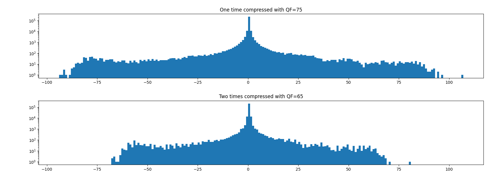{#fig-hist_qf1 fig-pos="H"}

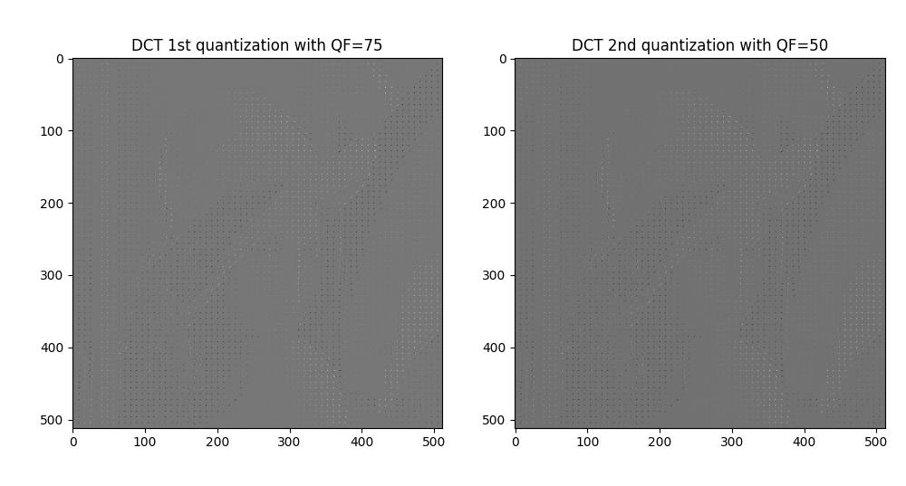{#fig-dct_qf1 fig-pos="H"}

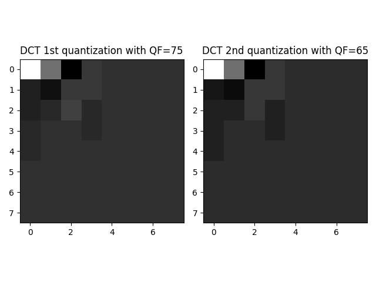{#fig-dct_qf12 fig-pos="H"}

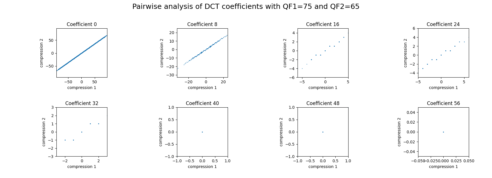{#fig-pair_qf1 fig-pos="H"}

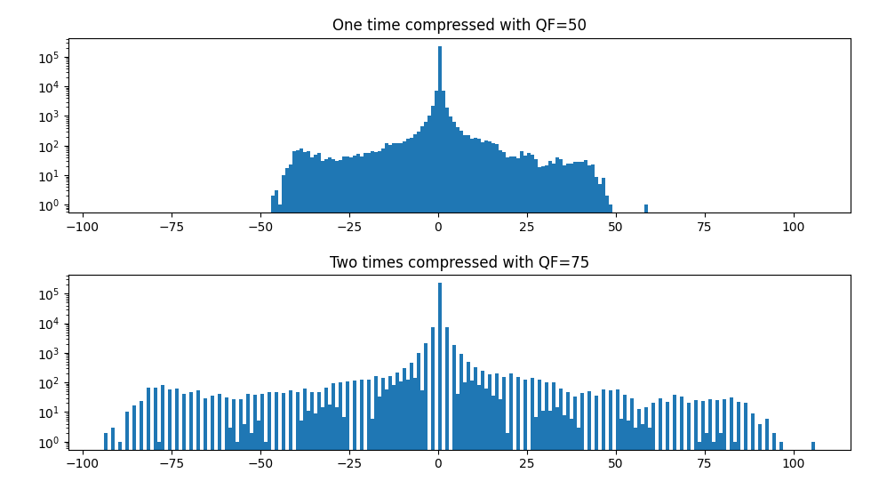{#fig-hist_qf2 fig-pos="H"}

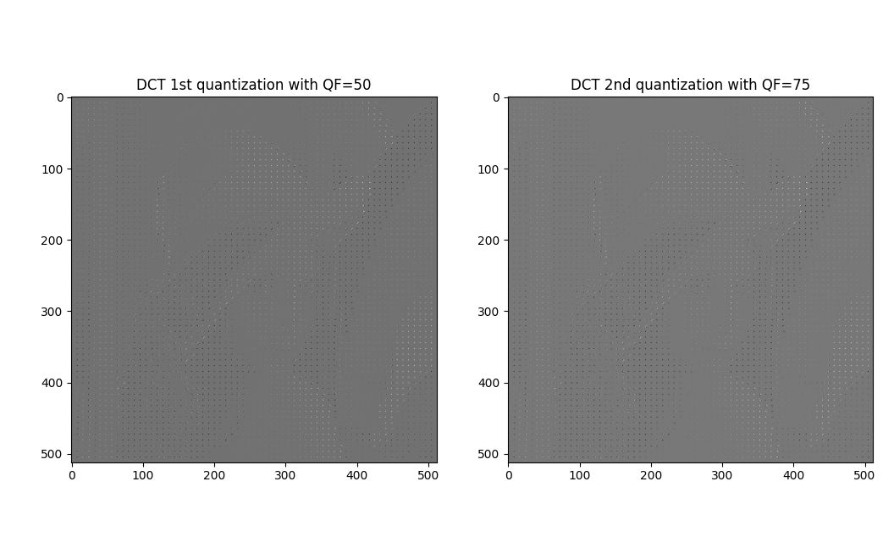{#fig-dct_qf2 fig-pos="H"}

{#fig-dct_qf22 fig-pos="H"}

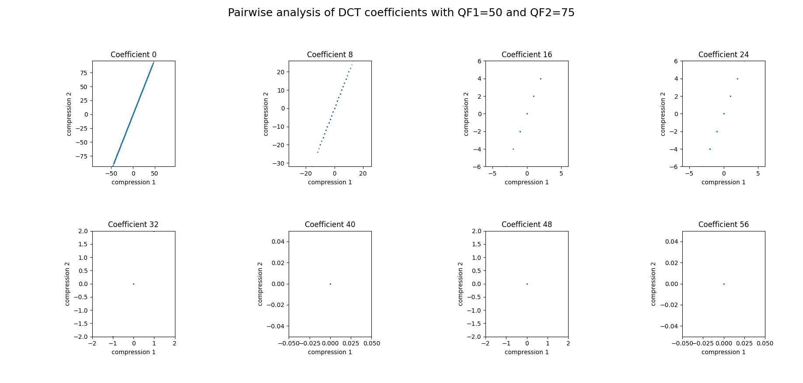{#fig-pair_qf2 fig-pos="H"}

## Image manipulated 1

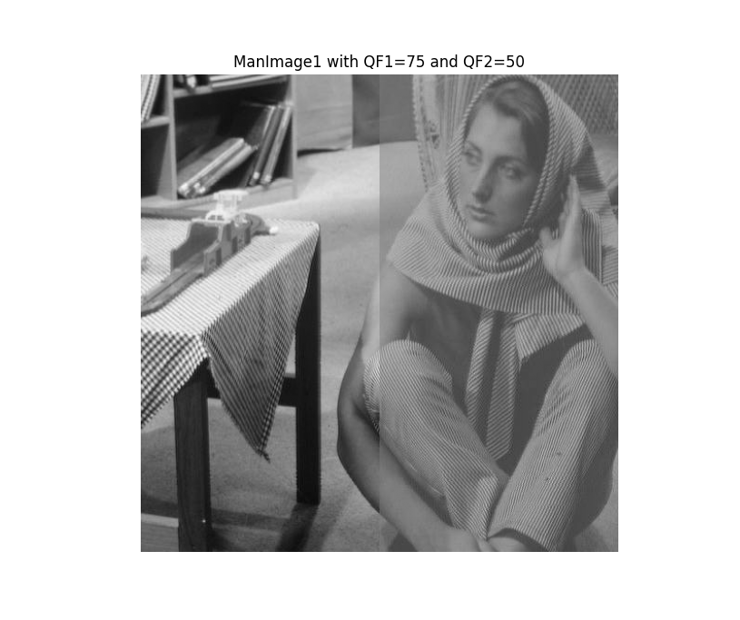{#fig-man1_qf1 fig-pos="H"}

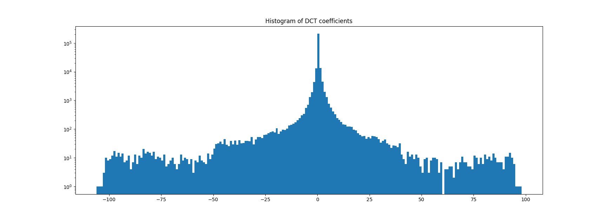{#fig-man1_hist_qf1 fig-pos="H"}

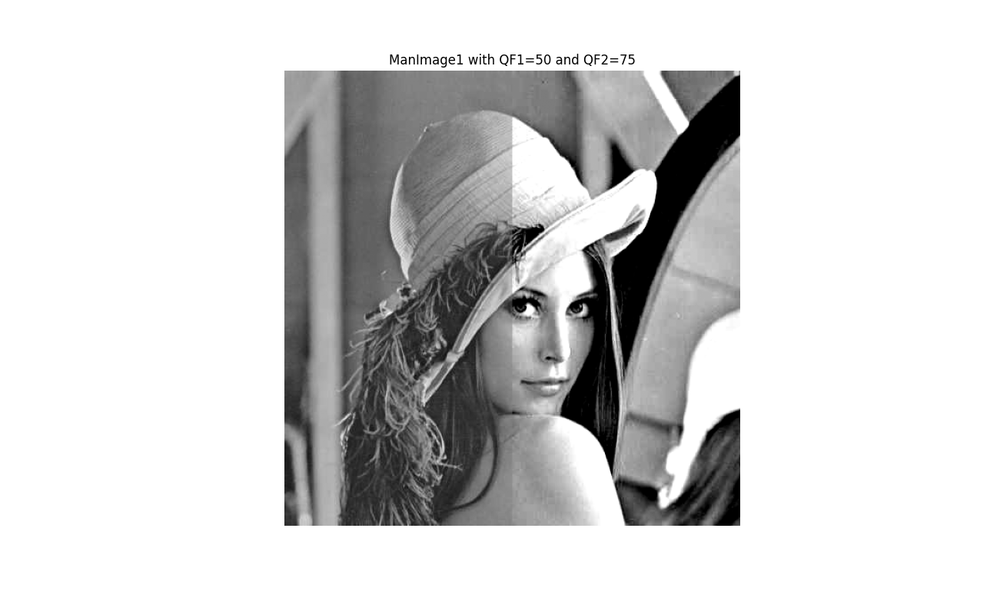{#fig-man1_qf2 fig-pos="H"}

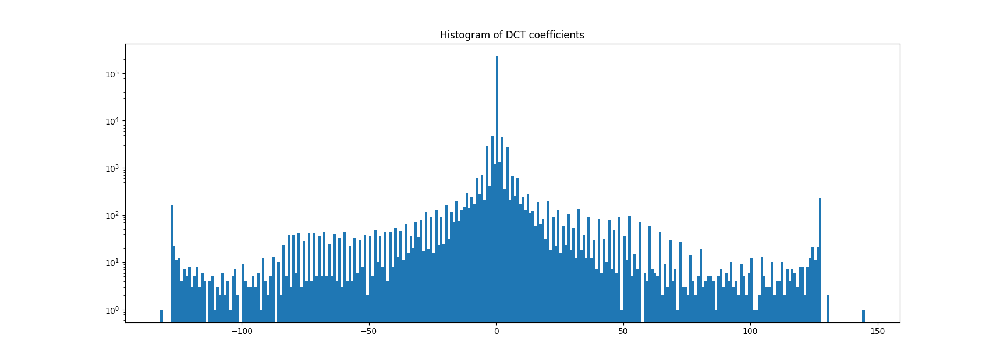{#fig-man1_hist_qf2 fig-pos="H"}

## Image manipulated 2

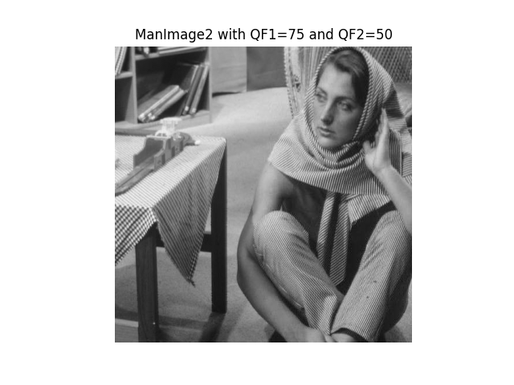{#fig-man2_qf1 fig-pos="H"}

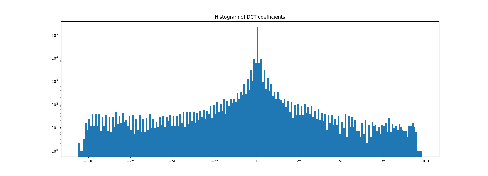{#fig-man2_hist_qf1 fig-pos="H"}

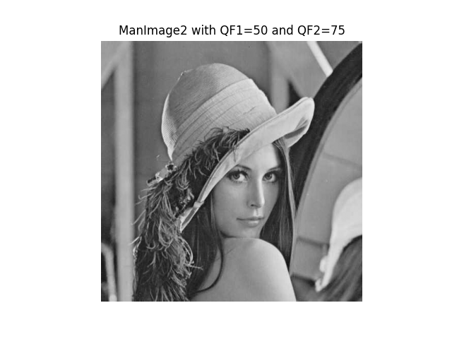{#fig-man2_qf2 fig-pos="H"}

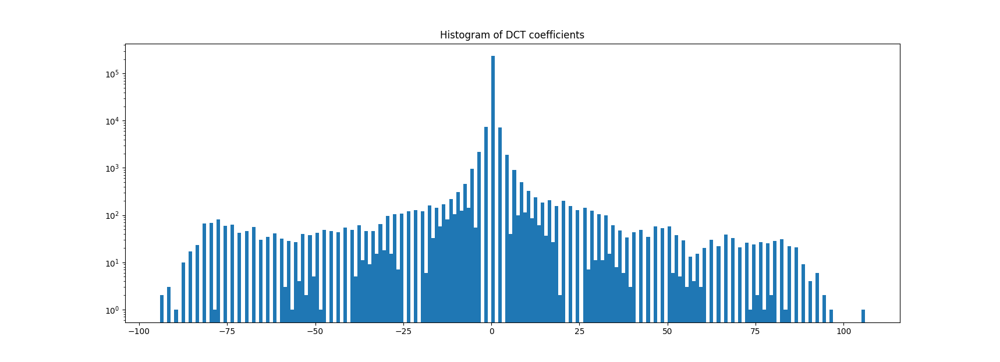{#fig-man2_hist_qf2 fig-pos="H"}

## Example of an original image

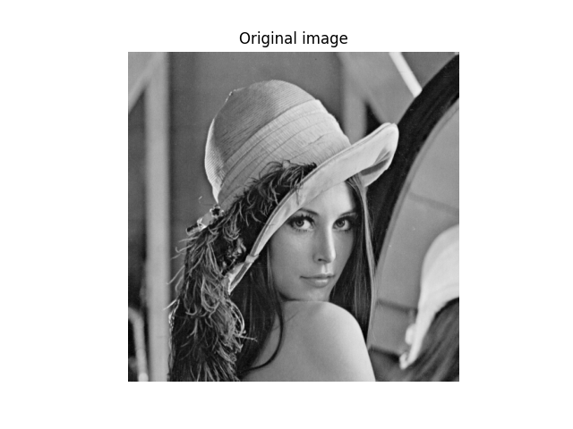{#fig-original fig-pos="H"}

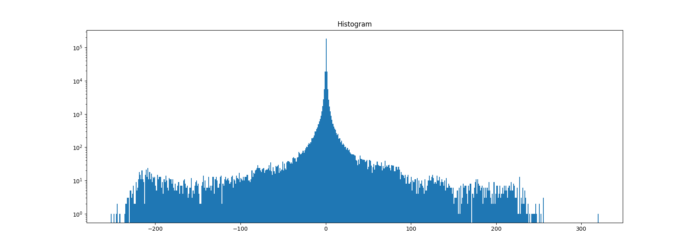{#fig-original_hist fig-pos="H"}

\newpage

# Discussion

## Double compression

What happens with double JPEG compression ?

As seen in the section [-@sec-q], a quantization matrix is applied during the JPEG compression.
However, when the image is compressed 2 times, it means that the quantization matrix is applied 2 times, which leaves artifacts.

Mathematicaly, when double JPEG compression is made, the final quantization becomes like in formula [-@eq-2q]

$$
C_{ij \ \text{quantized}} = round\left(round\left(\frac{C_{ij}}{Q_1}\right) \cdot \frac{Q_1}{Q_2}\right)
$$ {#eq-2q}

### $QF_1$ < $QF_2$

When the quality factor of first compression is less than the quality factor of the second compression, it's possible to see that during the second compression,
no change is made in the DCT, as shown on figure [-@fig-dct_qf22]
because the two figures are identical, meaning that DCT are the same.
However, if we look at the pairwise analysis ([-@fig-pair_qf2]), we can see that the coefficients are not equaly distributed between compression 1 and compression 2.
It's like if the coefficients was the same, because the plots follow a linear progression, but spread over a larger range due to the quantization matrix.

And if we look at the histogram of the DCT coefficients, it's easily possible to see that the coefficients of the DCT are extended in a bigger range: $[-100, 100]$ instead of $[-50, 50]$.
However, no "new" data appears meaning that the histogram has a lot of holes between values.

This is due to the redistribution of quantized coefficients,
which is broader in the case of a higher quality factor because more coefficients are retained,
creating gaps because coefficients have already been removed by the first lower quantization.

So the double JPEG compression is easily detectable when the quality of the first compression is worse than the quality of the second compression.

### $QF_1 > QF_2$

When the quality factor of first compression is greater than the quality factor of the second compression, some DCT coefficients are deleted during the second compression,
like shown on figure [-@fig-dct_qf12] where more different blocks appears in the first quantization compared to second quantization, each block representing a DCT coefficient.

And if we look at the pairwise analysis [-@fig-pair_qf1], we can see that DCT coefficients of the first quantization are in a range of $[-5, 5]$ for coefficient 16 for instance
whereas DCT coefficients of the second quantization are in a range of $[-3, 3]$ in case of second quantization.
It means that compared to the first quantization that have many different values possibles for the DCT coefficients, the second quantization decrease the number of possible values for DCT coefficients, making some overlaps of coefficients.
For instance, in case of coefficient $16$, we can see that in first compression, there are on average 3 differents coefficients for 1 coefficient in case of second compression.

On the histogram ([-@fig-hist_qf1]), the double compression is detectable because there are some bins that contains more samples than neighbouring bins.
This happens because some bins receive more samples from original bins than other bins.

In this way, it's possible to detect a double compression with the first compression with a better quality than the second.

### Manipulated images

Two manipulated images have been created for experiment purpose.

The first manipulated image is manipulate in DCT domain: the DCT domain of the first manipulated image is composed of left part, DCT first quantization and right part, DCT second quantization.

If we look at the spacial domain, it's easy to see that the image is manipulated because the two parts don't have the same brightness, as shown on images [-@fig-man1_qf1] and [-@fig-man1_qf2].
This brightness difference is caused by the decoding of the second part of the image with not the same quantization matrix than for the encoding of this part itself.
In some case, like when the decoded is made with a stronger quantization caused by a weaker quality factor, some artifacts can appears in the histogram like shown on figure [-@fig-man1_hist_qf2].
Theses artifacts are some pics at the extremities of the histogram.
This is caused by the decoding with stronger quantization, knowing that encoding has kept more coefficients, which causes an accumulation of coefficients on extremities.
In fact, theses coefficients would not have been accumulated at the edges if quantization had remained consistent.

The second manipulated image is manipulate in spacial domain: the image is composed in left part by the one-time compressed image and in the right part by the 2 times compressed image.
Due to the imperfections of the human visual system, differences are not perceptible on images in spacial domain, as shown by images [-@fig-man2_qf1] and [-@fig-man2_qf2].

If we look at manipulated image in DCT domain, if the second compression is achieved with a quality factor less than the first compression, the histogram of DCT coefficients
seems to be the histogram of a real image with no manipulations.
So this method don't work for this specific case.
But fortunately, we can visualy see the difference, so we can determine that image is modified.
In more general way, the fact that the image has been modified may instead become apparent during a different analysis step of the image, such as an analysis of shadows and highlights or something else.

The manipulated image in DCT domain with a first compression weaker than the second will appears in histogram as bins that are bigger than neighbors bins [-@fig-man1_hist_qf2].
This behavior is not normal for the histogram of the DCT coefficients of the image.
Indeed, if we look at what the histogram of an unmodified image looks like, like histogram [-@fig-original_hist], there is no behavior with bins that are larger than their neighbors in a regular manner.
So we can conclude that image is modified due to the obtained histogram.


\newpage

# Conclusion

Blablablablblablblablalblablalablablablblablblablalblablal
