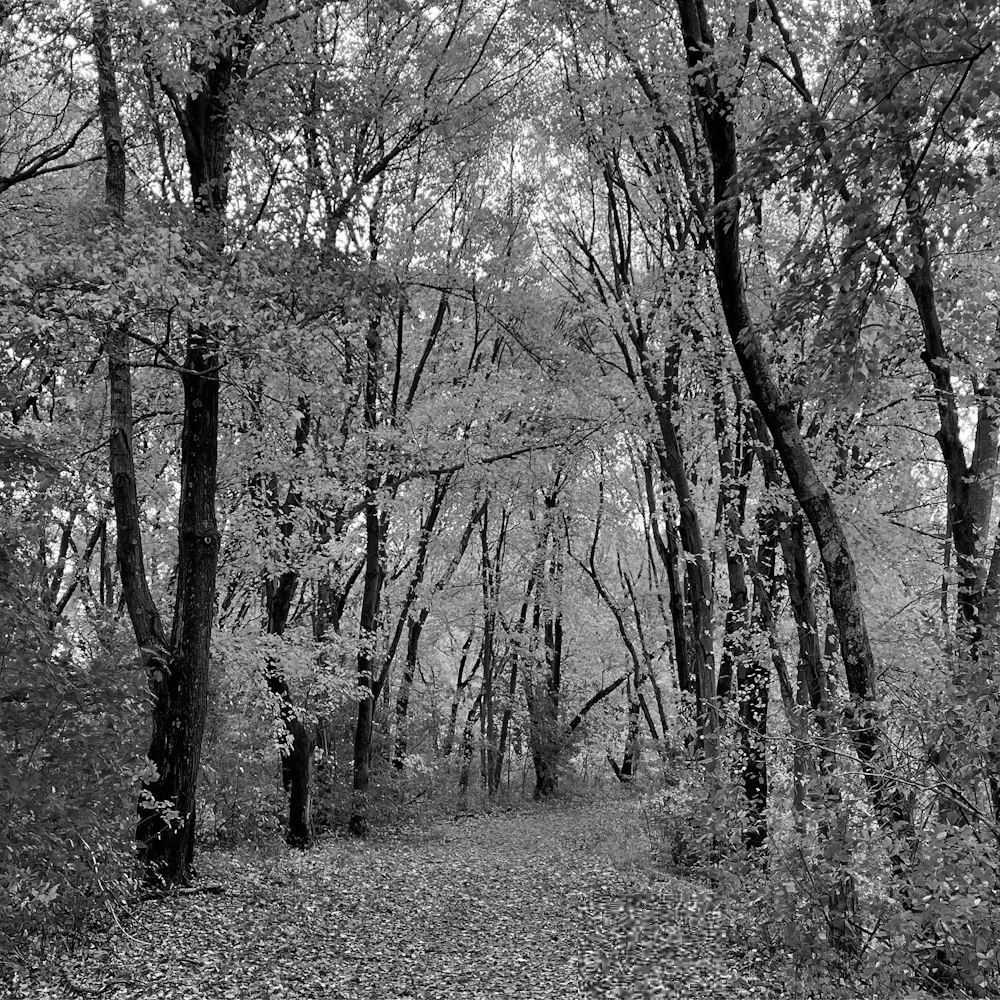
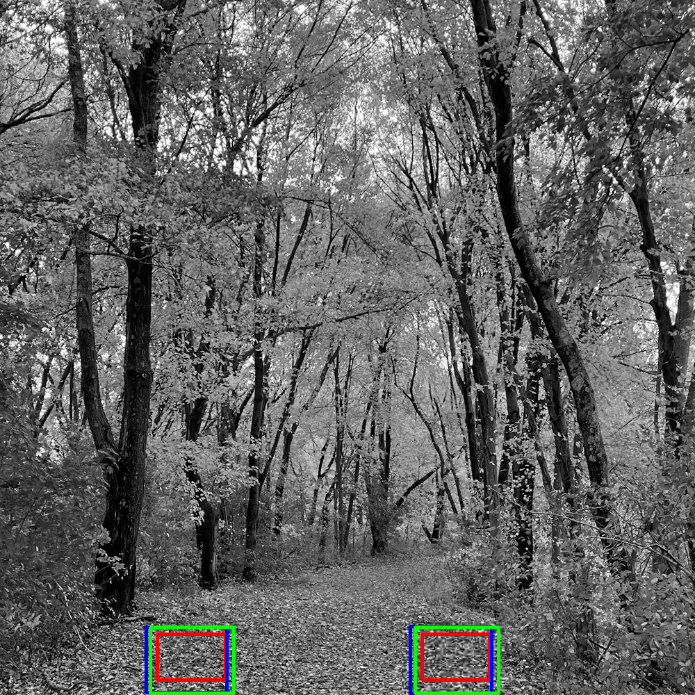

\newpage

# Introduction

Image tampering has been practiced since the dawn of photography,
both to hide important information that could exonerate guilty parties in court and to add information that could incriminate some innocent people in court.
That's why the digital forensic is used to know the history of an image in order to administer justice properly.

To add more informations, like more people in a crow or more missiles in a photo or something else, some parts of the image can be exploited and duplicated in order to achieve the desired effect.
And to hide some informations, such as the presence of a vehicle at a given place and time or something else, some parts of the image can be duplicated and pasted over the object to make it disappear.

To deal with this kind of attacks on the integrity of an image, some digital forensic methods are used to detect similar patterns in the image.

The work will consist of testing some of these methods on modified images to see how effective the detection is.

\newpage

# Methodology {#sec-met}

## Scale-Invariant Feature Transform (SIFT) {#sec-sift}

This algorithm was developped by David Lowe in 1999 to detect object in different viewing conditions.
For instance, this algorithm is able to detect that the building is the same between an image taken when it rains and when the weather is nice.

The algorithm start by creating a scale space consisting of multiple layers.
Each layer is composed by a blurred original image and a downsampled image.
From these layers, a pyramid is constructed, starting with a less blurred layer and a less undersampled image at the base,
then progressively blurrier layers with more undersampled images appear in the upper layers.

Then, the SIFT algorithm extracts contrast variation by a difference between 2 blurred images, which is called the Laplacian of Gaussian.
This gives the keypoints to work with.
The keypoints are then affined thanks to Taylor Series Expansions, which erase weak keypoints.

Then the computation of the gradient of each keypoint allows to render them rotation invariant.
In fact, gradient gives direction of brightness changes.
The main directions are then captured, so that when two objects are rotated differently,
alignment according to rotation will always be possible thanks to the main directions of contrast change.
In this way, keypoints become rotation invariant.

Finaly, a keypoint descriptor, representing the given keypoint, is created to allow comparison between keypoints.

The multiple layers allows to detect an object at each scale, allowing to not miss object with specific scale.

So this method allows to detect object rotated and scaled in an image thanks to keypoint analysis and feature extraction.

## Speeded-Up Robust Features (SURF) {#sec-surf}

The Speeded-Up Robust Features algorithm is based on SIFT algorithm ([-@sec-sift]) and was developed, among other things, by researchers from ETH Zürich around 2006.
This algorithm detects keypoints regions by using box filters, which are approximation of the Laplacian of Gaussian (LoG).
Then keypoints are located using the Hessian matrix which is constructed via the box filters (a faster alternative to compute gradient of laplacian of gaussian (LoG)).
The descriptors are then computed based on Haar wavelet responses, allowing once again comparison accross different images.

This method is known to be faster. but generaly less accurate than the SIFT method, particulary when dealing with more complex transformations.

## Accelerated KAZE (AKAZE)

The accelerated KAZE algorithm follows the same structure than the two other algorithms:
First, to identify regions of interest, this algorithm use a non-linear reduction scale by the usage of anisotropic diffusion (image is blurred directionaly, preserving important details like textures while reducing noise).
Next, keypoints are located by analysing the extrema whithin theses regions of interest.
Finaly descriptors are computed based on the gradient responses around keypoints.^[Understanding of algorithms is based on Wikipedia, ChatGPT and other websites]


\newpage

# Implementation {#sec-impl}

The implementation was made by `cantugba` on github repository [Copy_Move_Forgery_Detection](https://github.com/cantugba/Copy_Move_Forgery_Detection/tree/main#r).

However, to test algorithm with different images, an image of a forest path of size $1000\times1000$ was used.

In order to save results of applied methods, the function `def saveImage(self)` has been modified in `GUI/FacadeGui.py`.
The modification made is simply a replacement of variable `self.NPimg` by `self.image` because `self.NPimg` is only initialized whereas `self.image` is updated at each step.
So the saved image is the updated image and not the only initialized variable.

Then, a python script create new test images by cropping a part of the original image and placing it in a different location.

The python script creates test images with the crop unchanged, rotated, rescaled, double compressed and noised.

The crop has been placed in such a way it's not easily detectable without image analysis.

The python script follows the given documentation:

```{text}
usage: tp4.py [-h] -i IMAGE

Test images generation

options:
  -h, --help         show this help message and exit
  -i, --image IMAGE  Original image used to create test images
```

So to generate test images for the forest image, the following command can be executed:

```{bash}
python tp4.py -i ./1000.jpeg
```

\newpage

# Results

## No Modification

::: {#fig-no_modification layout-ncol=2}
{#fig-no_modification width="90%"}

{#fig-no_modification width="90%"}
:::

## Noise

::: {#fig-noise_20 layout-ncol=2}
{#fig-noise_20 width="90%"}

{#fig-noise_20 width="90%"}
:::

::: {#fig-noise_30 layout-ncol=2}
{#fig-noise_30 width="90%"}

{#fig-noise_30 width="90%"}
:::

## Rescaling

::: {#fig-rescale_0_5 layout-ncol=2}
{#fig-rescale_0_5 width="90%"}

{#fig-rescale_0_5 width="90%"}
:::

::: {#fig-rescale_0_6 layout-ncol=2}
{#fig-rescale_0_6 width="90%"}

{#fig-rescale_0_6 width="90%"}
:::

::: {#fig-rescale_0_7 layout-ncol=2}
{#fig-rescale_0_7 width="90%"}

{#fig-rescale_0_7 width="90%"}
:::

::: {#fig-rescale_0_9_1_1 layout-ncol=2}
{#fig-rescale_0_9_1_1 width="90%"}

{#fig-rescale_0_9_1_1 width="90%"}
:::

::: {#fig-rescale_1_5 layout-ncol=2}
{#fig-rescale_1_5 width="90%"}

{#fig-rescale_1_5 width="90%"}
:::

## Rotation

::: {#fig-rotate_45 layout-ncol=2}
{#fig-rotate_45 width="90%"}

{#fig-rotate_45 width="90%"}
:::

::: {#fig-rotate_90 layout-ncol=2}
{#fig-rotate_90 width="90%"}

{#fig-rotate_90 width="90%"}
:::

## Compression

::: {#fig-compression_70_40 layout-ncol=2}
{#fig-compression_70_40 width="90%"}

{#fig-compression_70_40 width="90%"}
:::

::: {#fig-compression_70_20 layout-ncol=2}
{#fig-compression_70_20l width="90%"}

{#fig-compression_70_20r width="90%"}
:::

::: {#fig-compression_70_5 layout-ncol=2}
{#fig-compression_70_5l width="90%"}

{#fig-compression_70_5r width="90%"}
:::

\newpage

# Discussion

The results of both methods are quite different depending on situations.

## No Modification

When the crop is not modified, the detection works quite well, like shown on @fig-no_modification.

## Noise

For the added noise, a gaussian noise with a mean of $0$ and a standard deviation of $20$ and $30$ was tested.
It means that pixels can vary between $0$ and $255$, with an additional variation of $\pm 20$ (or $\pm 30$ respectively).
This gaussian noise is rather strong.

For the standard deviation of $20$, all methods work well as shown on @fig-noise_20.
However, for the standard deviation of $30$, the SIFT and SURF methods fails whereas the AKAZE method find something.
In reality, methods don't really fail, because each of them detects something abnormal in the image.
But the AKAZE method give approximatively the right result whereas SIFT and SURF give a "global" region where are similarities.
So in case where the cropped image is severely "damaged", the AKAZE method is more accurate than the SIFT and SURF method.

For a larger standard deviation, none of the methods work.
But detection already works very well for crops that are already severely damaged because a standard deviation of $20$ acted as if the crop was severly damaged.

## Rescaling

More sample have been made for this section, allowing a study of the rescaling impact on both methods.

With a crop 2 times downscaled, only the AKAZE method works and detect something.
However, the detection is not very accurate, because the result is a kind of global region with both original and downscaled crop.
In this way, it's possible only with the AKAZE method to see that something is wrong on the image, but we don't know exactly what.

With a crop that is rescaled $0.6$ times, only the AKAZE and SIFT methods find the downscaled crop whereas the SURF method crashes.
However, the result given by SIFT and AKAZE method is pretty good and delimites the modified area fairly well, but not perfectly.
It means that SIFT and AKAZE methods are more accurate than SURF method when detecting downscaled image.

With a crop $0.7$ times rescaled, both methods work.
However, only the SIFT method give an accurate result whereas SURF and AKAZE methods give only a global region which includes the original crop and the downscaled crop.
So the SIFT method is more accurate than the SURF and AKAZE for downscale problems.
However, why the AKAZE method works less well than for a stronger downscaling ?
I think it's probably due to the `anti_aliasing` that perform some interpolation to achieve less aggressive downscaling.
Or the AKAZE method is less stable than the SIFT method.

A test has been achieved with a crop rescaled differently in $x$ and $y$ directions.
The result is that for $x$ direction downscaled $0.9$ times and $y$ direction upscaled $1.1$ times, both methods detect the modification.
But with an $x$ direction downscaled $0.8$ times and $y$ direction upscaled $1.2$ times, all methods crash and find no solution.
So it means that in case of non uniform rescaling, the methods can easily crash, which is a significant limitation of these methods.
Indeed, if an object is duplicated and resized unevenly, nothing is detected...

With a crop upscaled $1.5$ times, both methods work well and find the modified region on the image.

## Rotation

For all rotations, the methods work well and find the modified part of the image.
It make sense because each method is made rotation invariant, as described in @sec-met.

## Double compression

Using double JPEG compression don't impact both methods.
In fact, this makes sense, because the goal of JPEG compression is to preserve an image as close as possible to the original image
by removing certain information that is not very visible to the human visual system.
In this way, the main structure of the image is kept intact as much as possible.
That's why both methods can extract good features to make comparison and find modified regions.

However, when I execute the code for double compression with $QF_1 = 70$ and $QF_2 = 5$, if I start by executing method AKAZE or SIFT, the program crashes
whereas if I start with SURF method, this method work and the two other too.
It means that perhaps the implementation is not perfect and need some adjustments.

\newpage

# Conclusion

The SIFT, SURF and AKAZE algorithms allows to detect copy-paste attacks on images thanks to a study of object descriptors.
Both methods start to identify regions of interest, extract from theses regions some keypoints and compute for each keypoint a descriptor that can be used later for comparison.
In this way, copy-move attacks can be fighted by theses algorithms.
In practice, these methods work very well for unmodified, rotated and double-compressed copy-move object, and quite well for noised and rescaled object.

The @tbl-summary summarizes the various observations made.

|| SIFT | SURF | AKAZE |
|:-|:-:|:-:|:-:|
|No Modification|+++|+++|+++|
|Noise detection|+++|+++|+++|
|Noise accuracy|++|++|+++|
|Rescaling detection|++|+|+++|
|Rescaling accuracy|+++|+|++|
|Non-uniform rescaling| - | - | - |
|Rotation|+++|+++|+++|
|Double JPEG Compression detection|+++|+++|+++|
|Double JPEG Compression stability|++|+++|++|

: Summary of tests achieved {#tbl-summary}


In case of non-uniform rescaling, all methods tend to crash.
That's why, although we have been dependent on the given implementation, we may wonder whether these methods have variant that take care of non-uniform rescaling.
